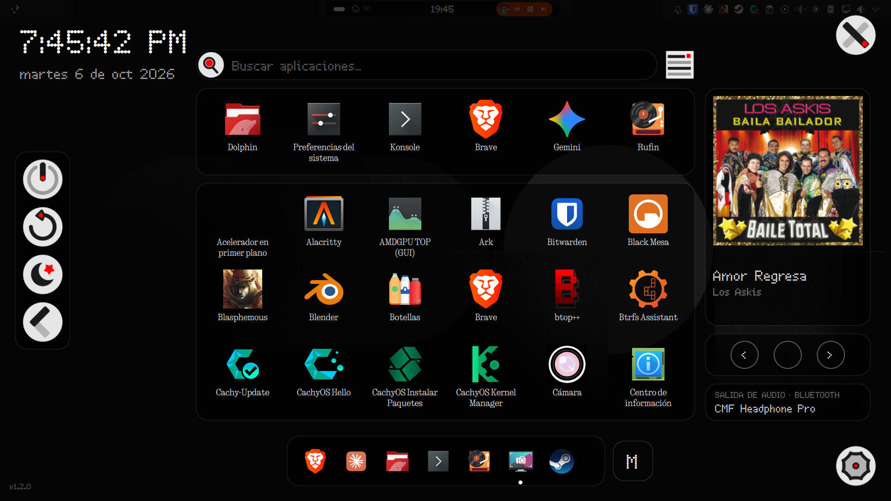
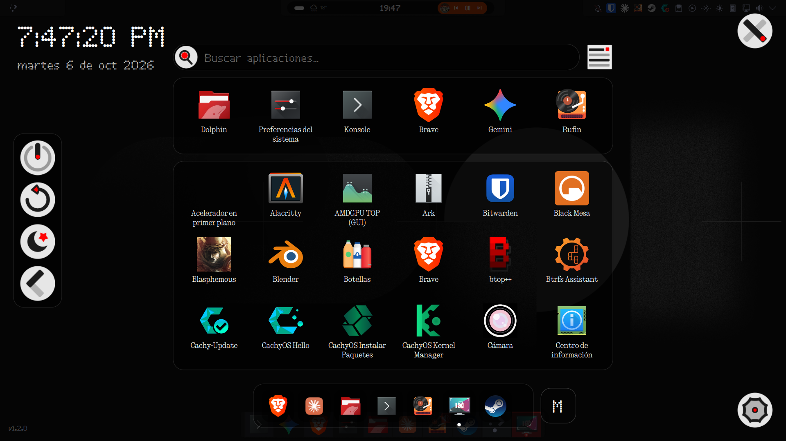
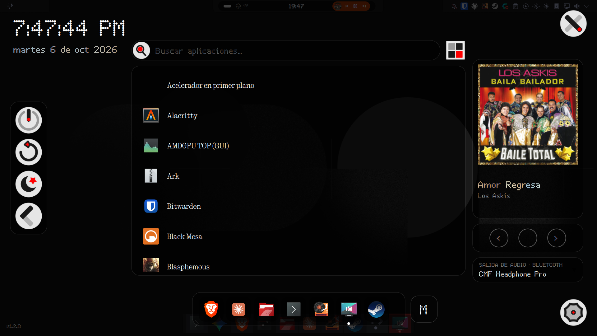
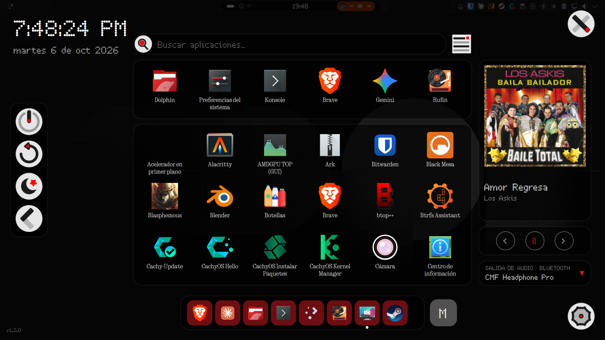
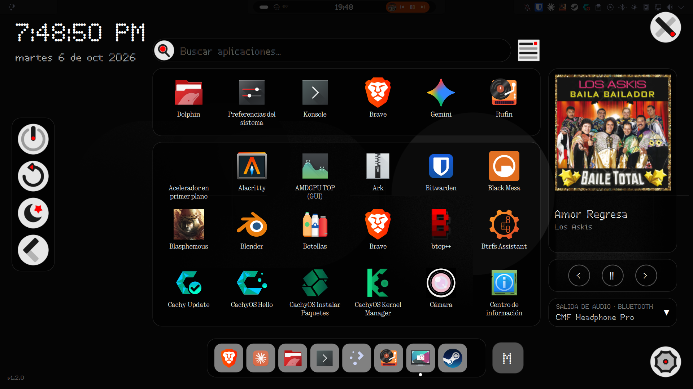
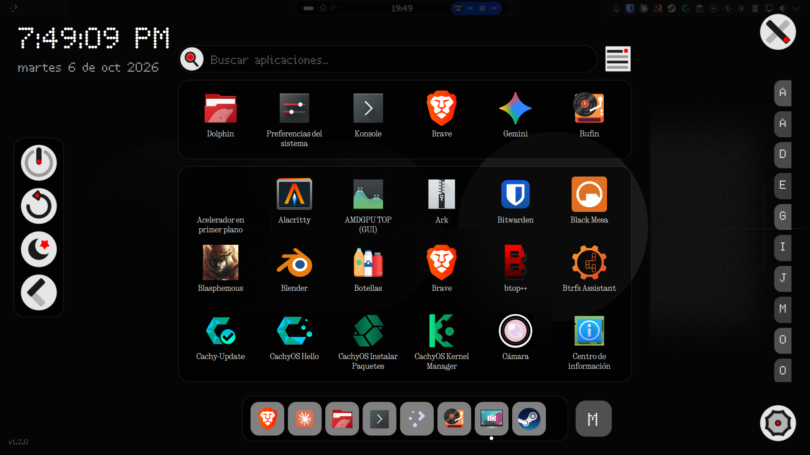

# NonDot Launcher

*Español: [más abajo](#español).*

A full-screen application launcher for KDE Plasma 6 with a dot-matrix, Nothing-phone-inspired look: black translucent bubbles, thin borders, a red accent, and optional dotted fonts.

> Unofficial. It is **not** made by, affiliated with, or endorsed by Nothing Technology Limited. "Nothing" is a trademark of its owner; the name "NonDot" only describes the look.

## Screenshots














## Features

- Opens full screen on the monitor you are using (click on the widget, or the launcher shortcut).
- Live search, grid or list view, most-used and recent apps row, keyboard navigation with the arrow keys.
- Active-apps bar (optional). Without it the grid gets one more row.
- Right area, your choice: **media player** (cover, title, artist, previous / pause / next, and audio output switcher), **category cards**, or nothing. The **M button** switches between them without leaving the launcher.
- Session buttons (power off, restart, suspend, switch user), right-click menu with the app actions.
- Settings: colors and opacities, a font per area, every animation switchable one by one, 12/24 h clock with or without seconds, written or numeric date, and an **interface language selector (English / Spanish)** that does not depend on the system language.
- If an optional KDE module is missing or KDE changes something, only that feature turns off and a notice explains what to do.

## Requirements

- KDE Plasma 6 (written and tested on 6.7.5, Wayland, Qt 6.11). Other versions are untested.
- It uses private KDE modules (Kicker, MPRIS, volume), which KDE may change without notice. If that happens the plasmoid tells you instead of breaking.

## Install

From the KDE Store: right-click the panel or desktop → *Add or Manage Widgets…* → *Get New…* → search "NonDot Launcher".

From a file:

```
kpackagetool6 -t Plasma/Applet -i nondot-launcher.plasmoid     # first time
kpackagetool6 -t Plasma/Applet -u nondot-launcher.plasmoid     # update
systemctl --user restart plasma-plasmashell                      # reload Plasma
```

Then add the widget to a panel. Click it to open the launcher.

### Using the Meta key

You do not need to assign anything: Plasma has a single "Activate Application Launcher" shortcut (Meta) and sends it to the **first widget it finds that declares itself a launcher** — looking first at the panels of the monitor where you are, in order. NonDot Launcher declares itself a launcher, so Meta opens it as long as no other launcher widget (Kickoff, Kicker, another custom launcher…) comes before it in that panel. If Meta opens something else, remove the other launcher widget from the panel or move NonDot Launcher before it.

**If Meta does nothing or opens a different widget:** Meta may have been reassigned. This happens if you once gave Meta directly to another widget and accepted the conflict warning: Plasma then takes Meta away from "Activate Application Launcher". To check: `grep -n "Meta" ~/.config/kglobalshortcutsrc` and look for a line like `activate widget NNN=Meta,…` (that widget owns Meta) and for `activate application launcher=Alt+F1,…` (without Meta). To fix it, either:

1. *System Settings → Keyboard → Shortcuts*: remove Meta from that widget, then add Meta to "Activate Application Launcher" (accept *Reassign*); or
2. right-click NonDot Launcher → *Configure* → keyboard shortcut → assign Meta directly to it.

## Fonts

The plasmoid **does not bundle any font** and uses your system font by default. This is on purpose: the typefaces that give the Nothing look are not free to redistribute inside a package, and a launcher should not ship files whose licence it cannot guarantee.

To get the dotted look, install a dot-matrix font and choose it in *Configure → Fonts* (one font per area: clock, search, app names, buttons, cards, media player). A free one you can use is **Doto** (Google Fonts, Open Font License); always check the licence of any font you install. If you own a font such as the ones Nothing uses, install it and pick it the same way. After installing a font, restart Plasma so it appears in the list.

## Hide it from Alt+Tab and the taskbar (optional)

The launcher window shows up in Alt+Tab and the system taskbar. To hide it, create a KWin window rule:

1. *System Settings → Window Management → Window Rules → Import…* and choose `nondot-launcher.kwinrule` (included in this repository), **or**
2. Create a rule manually: window title, *exact match*, `NonDot Launcher`; add the properties *Skip taskbar*, *Skip switcher* and *Skip pager* with the value *Force → Yes*.

(The included rule file has not been tested on every Plasma version.)

## What it runs on your system

- `busctl --user call org.kde.KWin /KWin org.kde.KWin activeOutputName` to know which monitor is active when you press the shortcut.
- `systemsettings` when you click the settings button.
- No network access. No telemetry.

## Known limitations

- Appears in Alt+Tab and the taskbar unless you add the window rule above.
- No blur behind the window (Plasma's blur cannot be turned off from QML in the stock dashboard window, so a plain window is used).
- Settings tab names (left column) stay in English; their content follows the chosen language.

## Troubleshooting

Run `plasmashell --replace` from a terminal and look for lines starting with `NonDotLauncher`. If a notice window appears, copy its report ("Copy report") and include it when you open an issue.

## License

GPL-2.0-or-later. See `LICENSE`. Icons are original SVG drawings included in the package.

---

# Español

Lanzador de aplicaciones a pantalla completa para KDE Plasma 6 con aspecto de puntos inspirado en los teléfonos Nothing: burbujas negras translúcidas, bordes finos, acento rojo y fuentes de puntos opcionales.

> No oficial. **No** está hecho, afiliado ni respaldado por Nothing Technology Limited. "Nothing" es marca de su titular; el nombre "NonDot" solo describe el estilo.

Capturas de pantalla: ver [Screenshots](#screenshots) más arriba.

## Características

- Se abre a pantalla completa en el monitor que usas (clic en el widget o atajo del lanzador).
- Búsqueda en vivo, vista de cuadrícula o lista, fila de más usadas y recientes, navegación con las flechas del teclado.
- Barra de apps activas (opcional). Sin ella, la cuadrícula gana una fila más.
- Zona derecha a tu elección: **reproductor de medios** (portada, título, artista, anterior / pausa / siguiente y selector de salida de audio), **tarjetas de categorías** o nada. El **botón M** cambia entre ellas sin salir del lanzador.
- Botones de sesión (apagar, reiniciar, suspender, cambiar de usuario) y menú de clic derecho con las acciones de cada app.
- Ajustes: colores y opacidades, una fuente por zona, cada animación activable por separado, reloj de 12/24 h con o sin segundos, fecha con letras o numérica y **selector de idioma de la interfaz (inglés / español)** que no depende del idioma del sistema.
- Si falta un módulo opcional de KDE o KDE cambia algo, solo se apaga esa función y un aviso explica qué hacer.

## Requisitos

- KDE Plasma 6 (escrito y probado en 6.7.5, Wayland, Qt 6.11). Otras versiones no se han probado.
- Usa módulos privados de KDE (Kicker, MPRIS, volumen) que KDE puede cambiar sin avisar. Si pasa, el plasmoide te lo dice en lugar de romperse.

## Instalación

Desde la tienda de KDE: clic derecho en el panel o escritorio → *Añadir o gestionar widgets…* → *Obtener nuevos…* → busca "NonDot Launcher".

Desde un archivo:

```
kpackagetool6 -t Plasma/Applet -i nondot-launcher.plasmoid     # primera vez
kpackagetool6 -t Plasma/Applet -u nondot-launcher.plasmoid     # actualizar
systemctl --user restart plasma-plasmashell                      # recargar Plasma
```

Después añade el widget a un panel. Haz clic en él para abrir el lanzador.

### Usar la tecla Meta

No hace falta asignar nada: Plasma tiene un único atajo "Activar el lanzador de aplicaciones" (Meta) y lo envía al **primer widget que encuentra que se declare lanzador**, mirando primero los paneles del monitor donde estás, en orden. NonDot Launcher se declara lanzador, así que Meta lo abre siempre que ningún otro widget lanzador (Kickoff, Kicker u otro personalizado) esté antes que él en ese panel. Si Meta abre otra cosa, quita el otro lanzador del panel o coloca NonDot Launcher antes.

**Si Meta no hace nada o abre otro widget:** puede que Meta se haya reasignado. Pasa si alguna vez diste Meta directamente a otro widget y aceptaste la advertencia de conflicto: Plasma le quita entonces Meta a "Activar el lanzador de aplicaciones". Para comprobarlo: `grep -n "Meta" ~/.config/kglobalshortcutsrc` y busca una línea como `activate widget NNN=Meta,…` (ese widget tiene Meta) y `activate application launcher=Alt+F1,…` (sin Meta). Para arreglarlo, elige una opción:

1. *Preferencias del Sistema → Atajos de teclado*: quita Meta a ese widget y añádesela a "Activar el lanzador de aplicaciones" (acepta *Reasignar*); o
2. clic derecho en NonDot Launcher → *Configurar* → atajo de teclado → asígnale Meta directamente.

## Fuentes

El plasmoide **no incluye ninguna fuente** y usa la fuente del sistema por defecto. Es a propósito: las tipografías que dan el aspecto Nothing no se pueden redistribuir libremente dentro de un paquete, y un lanzador no debe incluir archivos cuya licencia no puede garantizar.

Para el aspecto de puntos, instala una fuente de puntos y elígela en *Configurar → Fuentes* (una por zona: reloj, buscador, nombres de apps, botones, tarjetas, reproductor). Una gratuita que puedes usar es **Doto** (Google Fonts, Open Font License); revisa siempre la licencia de cualquier fuente que instales. Si tienes una fuente como las que usa Nothing, instálala y elígela igual. Tras instalar una fuente, reinicia Plasma para que aparezca en la lista.

## Ocultarlo de Alt+Tab y de la barra de tareas (opcional)

La ventana del lanzador aparece en Alt+Tab y en la barra de tareas del sistema. Para ocultarla, crea una regla de ventana de KWin:

1. *Preferencias del Sistema → Gestión de ventanas → Reglas de ventana → Importar…* y elige `nondot-launcher.kwinrule` (incluido en el repositorio), **o**
2. Crea la regla a mano: título de ventana, *coincidencia exacta*, `NonDot Launcher`; añade las propiedades *Omitir barra de tareas*, *Omitir cambiador* y *Omitir paginador* con el valor *Forzar → Sí*.

(El archivo de regla incluido no se ha probado en todas las versiones de Plasma.)

## Qué ejecuta en tu sistema

- `busctl --user call org.kde.KWin /KWin org.kde.KWin activeOutputName` para saber qué monitor está activo al pulsar el atajo.
- `systemsettings` al pulsar el botón de ajustes.
- Sin acceso a la red. Sin telemetría.

## Limitaciones conocidas

- Aparece en Alt+Tab y en la barra de tareas salvo que añadas la regla de ventana.
- Sin desenfoque (blur) tras la ventana: el desenfoque de la ventana de panel de Plasma no se puede desactivar desde QML, por eso se usa una ventana simple.
- Los nombres de las pestañas de ajustes (columna izquierda) quedan en inglés; su contenido sí sigue el idioma elegido.

## Problemas

Ejecuta `plasmashell --replace` desde una terminal y busca líneas que empiecen con `NonDotLauncher`. Si aparece una ventana de aviso, copia su informe ("Copiar informe") y adjúntalo al abrir una incidencia.

## Licencia

GPL-2.0-or-later. Ver `LICENSE`. Los iconos son dibujos SVG originales incluidos en el paquete.
